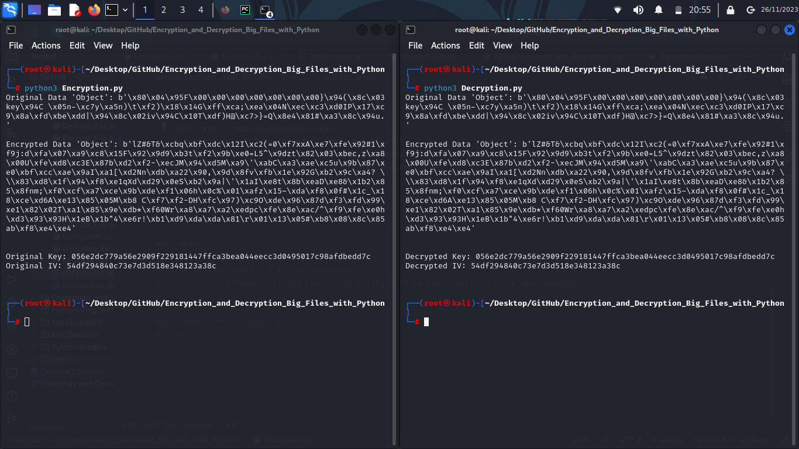
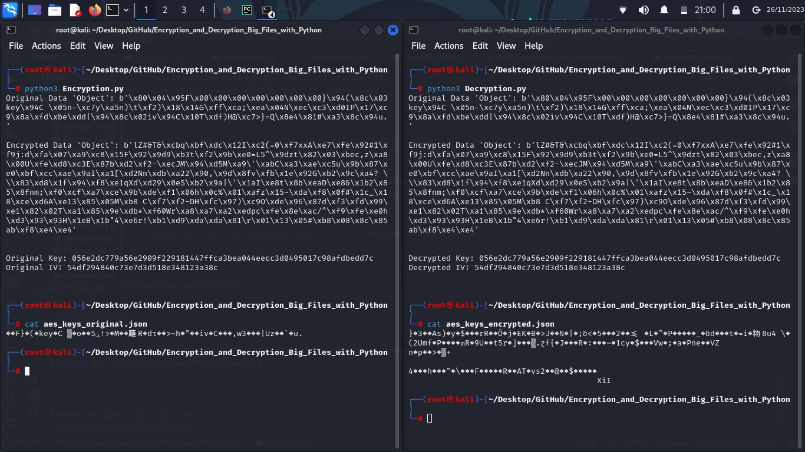
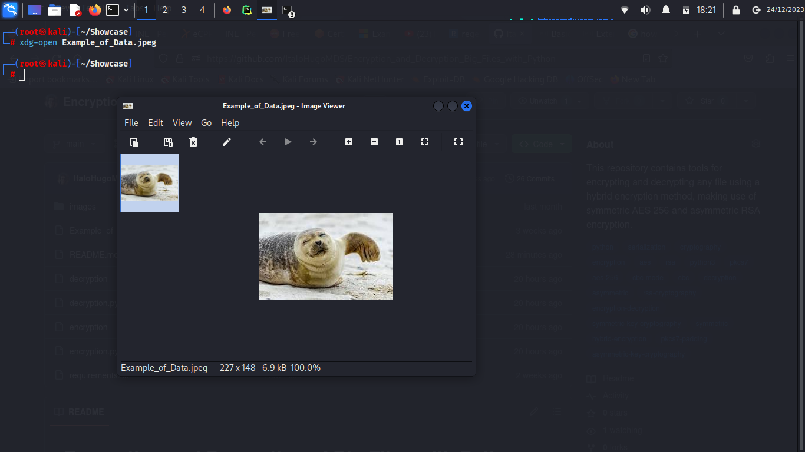
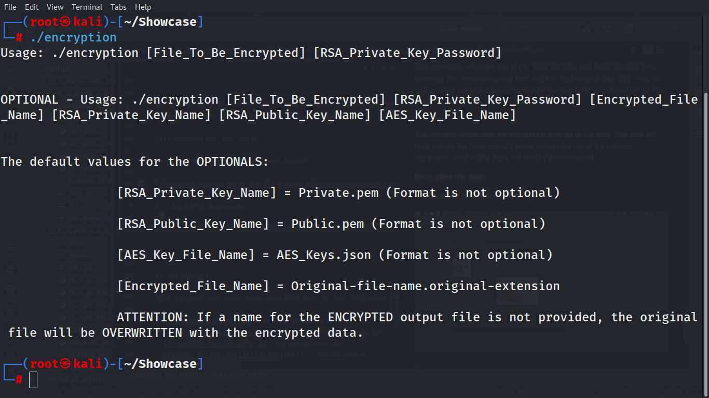
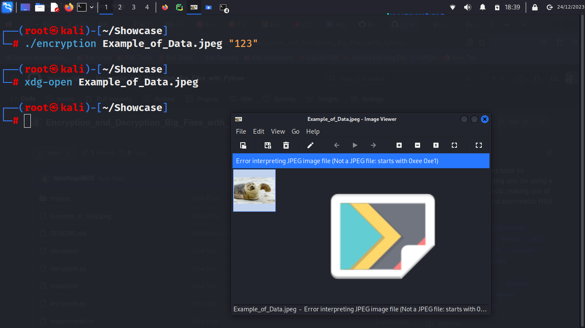
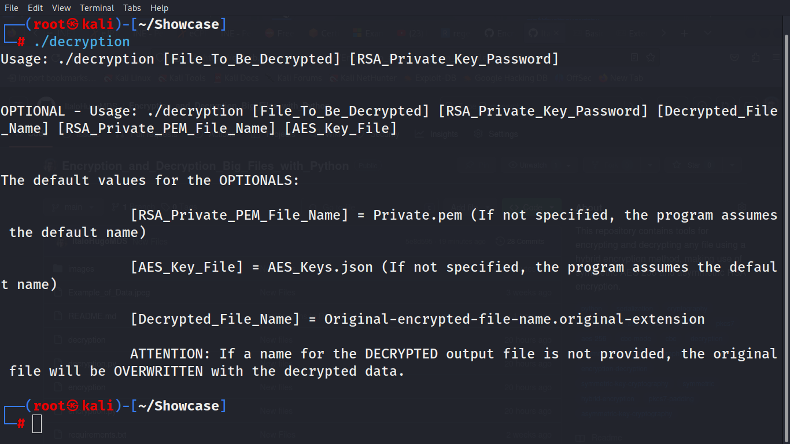
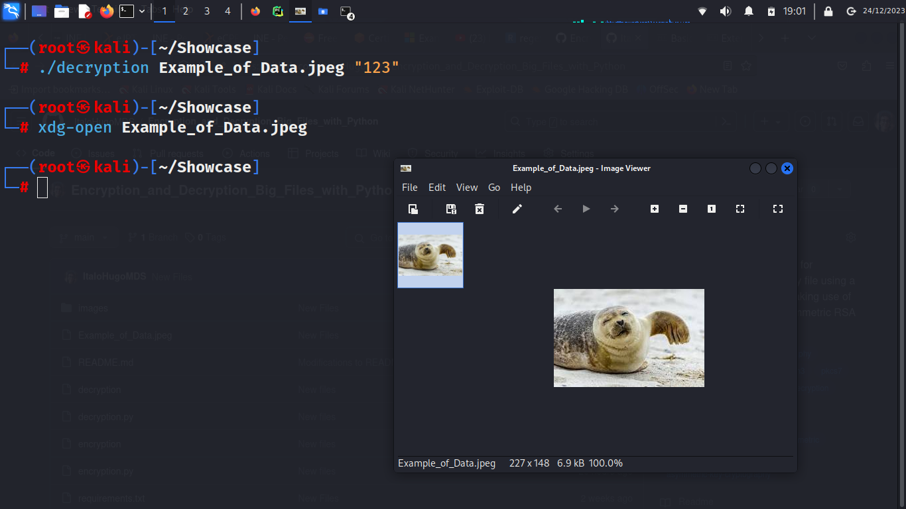
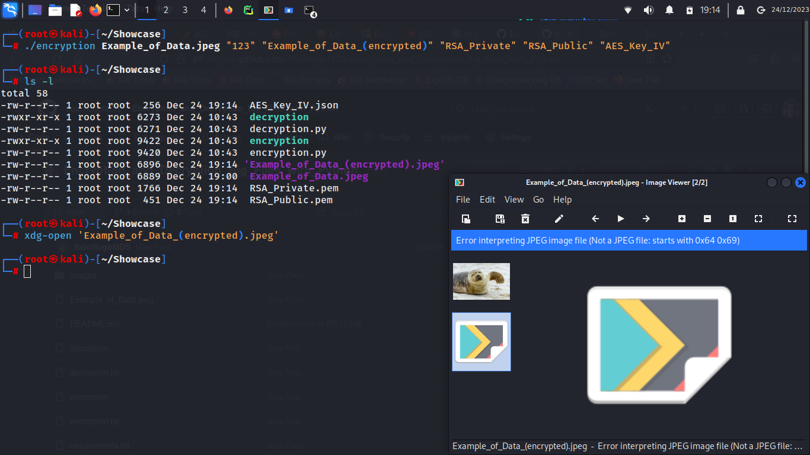
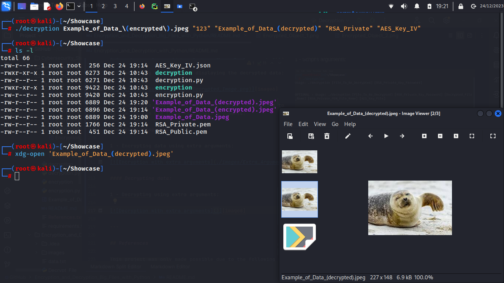

# Encryption and Decryption of Big Files with Python  

---

This repository contains tools for encrypting and decrypting **any** file using a **hybrid encryption** method, making
use of symmetric *AES 256* and asymmetric *RSA* encryption.  

This repository is an extension of the [Encryption and Decryption with Python][link1] project, portions of the code
from this project were used here. The implementations of the other technics were done by the owner of this repository.  

This project contains the **tools** and a **skill showcase**:

### Tool's functionality, click here: [Tools][tools]  

### Project's showcase, click here: [Showcase][showcase]  

---

### How does it work?  

The project works by using two scripts, one for encrypting the file and the other for decrypting it.  

### Encryption  

The process of encryption starts by loading the data-to-be-encrypted into the program memory. After loading the data
into memory, the symmetric and asymmetric keys are generated. For the symmetric encryption, a *key* is generated as a
random 256-bit value and another random 128-bit value is also generated to be used as the *initialization vector*,
necessary for the symmetric encryption.  

The **AES 256** object is then generated using the previously created *key* and *iv* (*initialization vector*), it uses
the **CBC** mode for the encryption. The **padding** object is also generated, it uses **PKCS7** as the padding method. 
After generating the keys and objects for the process, the data is first padded and then encrypted.  

Concluding the process of encryption, the program will encrypt the AES *key* and *iv* and serialize those. First, the
program generates the **RSA keys**. The **private key** is generated using a *public exponent* of 65537 and a *key size*
of 2048. The **public key** is generated as an instance of the previously created private key.  

After being generated, the RSA *public key* is used for encrypting the AES **keys** (**keys** is referencing to the AES
*key* and *iv*). When generating the AES *keys*, both the *key* and *iv* were created as a Python dictionary, which
contained the key and iv identifiers, with the same respective names, and the bytes used for the encryption process, as
the values associated with those identifiers. Therefore, the process of AES *keys* encryption doesn't happen by
encrypting the bytes used as the *key* and *iv*, but it encrypts the Python object which contains those bytes.  

The encryption of the object can be seen as follows:  

[][object1]

On picture 1, in the left terminal, can be seen the original object and the encrypted one, and the terminal on the right
displays the decrypted object, being equal to the original one, and the deserialized encrypted object.  

[][object2]  

On picture 2, in the left terminal, can be seen the encrypted `.json` AES keys. The terminal on the right displays the
decrypted json object.  

The first step for AES *keys* encryption is to transform the Python object into a byte object. After the conversion, the
object is then encrypted using the RSA *private key* encryption, and the encrypted data is serialized as a *json* file.
The following steps are the serialization of the RSA *keys*, which are serialized using the **PEM** encoding, as a
traditional **OpenSSH** format and using the **AES-256-CBC** as the encryption algorithm for the *private key*.  

### Decryption  

The decryption process is much simpler and follows just a few steps. The first step, it's to load encrypted data into
the program memory. After this, the next step is to deserialize the RSA *private key* and load it into program memory.
To complete the decryption process, the AES *keys* need to be deserialized and also loaded into program memory.  

The AES *keys* deserialization starts by loading the encrypted content of the json file into memory. After loaded, the
data is decrypted using the RSA *private key*, and the byte object is turned back into a Python object, which contains
the AES *key* and *iv* that will be used for decrypting the file.  

Finalizing the decryption process, the file's data is decrypted, using the previously deserialized AES *keys*, and
unpadded. After the decryption process, the data is written back into the original encrypted file.  

---

## How to use  

To use the tools, you can either download each file individually or you can clone this repository by executing the
following command:  

```
git clone https://github.com/ItaloHugoMDS/Encryption_and_Decryption_Big_Files_with_Python.git
```

First thing to be done before using the tools, it's to download the necessary libraries. To perform this step, the
[requirements.txt][file1] should be installed using `pip3`.  

Execute the following command to perform the installation:

```
pip3 install -r requirements.txt
```

After the library installation, the tools are ready to be used.  

The **encryption** can be done by using the [`encryption.py`][file2] file, which will require the `python3` command to
be executed, following the syntax:  

```
python3 encryption.py [File_To_Be_Encrypted] [RSA_Private_Key_Password] [Encrypted_File_Name] [RSA_Private_Key_Name] [RSA_Public_Key_Name] [AES_Key_File_Name]
```

The **encryption** process can also be done by making use of the [`encryption`][file3] file, which can be placed within
the `/bin` directory and executed anywhere on the linux terminal. The file follows the syntax:  

```
./encryption [File_To_Be_Encrypted] [RSA_Private_Key_Password] [Encrypted_File_Name] [RSA_Private_Key_Name] [RSA_Public_Key_Name] [AES_Key_File_Name]
```

Both files make use of the same arguments. The following arguments are **required** for the encryption process:  

- **[File_To_Be_Encrypted]:** The file that will be encrypted.  
- **[RSA_Private_Key_Password]:** This will be the password for the RSA **private** key used for decrypting the files.  

The next arguments are **optional** arguments:  

- **[Encrypted_File_Name]:** This will be the output for the encrypted file. If this argument is provided, the original
file will be preserved and the encrypted data will be written within a new file. **This argument doesn't affect the file
extension**, a new file will be created with the name provided, but the file extension will be the same as the original
file. (**By default**, the original file will be overwritten with the encrypted data.)  
- **[RSA_Private_Key_Name]:** This argument will change the name of the serialized **RSA private key**. **This argument
doesn't affect the file extension**, the RSA key will be serialized as a **PEM** file. (**By default**, this file will be
named **Private.pem**.)  
- **[RSA_Public_Key_Name]:** This argument will change the name of the serialized **RSA public key**. **This argument
doesn't affect the file extension**, the RSA key will be serialized as a **PEM** file. (**By default**, this file will be
named **Public.pem**.)  
- **[AES_Key_File_Name]:** This argument will change the name of the serialized **AES keys**, which contain the RSA
encrypted AES *key* and *initialization vector*. **This argument doesn't affect the file extension**, the AES key will
be saved as a json file. (**By default**, the file will be named **AES_Keys.json**.)  

The **decryption** process can be done by using the [`decryption.py`][file4] file, which needs the `python3` command to
be executed. This file requires the following syntax:  

```
python3 decryption.py [File_To_Be_Decrypted] [RSA_Private_Key_Password] [Decrypted_File_Name] [RSA_Private_PEM_File_Name] [AES_Key_File]
```

This process can also be done by using the [`decription`][file5] file, which can also be place inside `/bin` directory
and executed anywhere within the Linux terminal. The syntax for this file is the following:  

```
./decryption [File_To_Be_Decrypted] [RSA_Private_Key_Password] [Decrypted_File_Name] [RSA_Private_PEM_File_Name] [AES_Key_File]
```

Both decryption files make use of the same arguments. The following are the **required** ones:  

- **[File_To_Be_Decrypted]:** This will the file to be decrypted.  
- **[RSA_Private_Key_Password]:** This will be the same password used for the **encryption** process.  

The next arguments are **optional** ones, they are the following:  

- **[Decrypted_File_Name]:** This will be the output for the decrypted file. If this argument is provided, the original
encrypted file will be preserved and the decrypted data will be written within a new file. **This argument doesn't
affect the file extension**, a new file will be created with the name provided, but the file extension will be the same
as the original encrypted file. (**By default**, the original file will be overwritten with the encrypted data.)  
- **[RSA_Private_PEM_File_Name]:** This argument only needs to be provided if the **default value** of the **RSA private
key** file was modified in the **encryption** process. (**By default** the program will look for the **Private.pem**
file).  
- **[AES_Key_File]:** This argument only needs to be provided if the **default value** of the **AES Keys** file was
modified in the **encryption** process. (**By default** the program will look for the **AES_Keys.json** file).  

---

## Showcase  

In the skill showcase of the tools, the archive that will be used for encryption and decryption is going to be the
[Example_of_Data.jpeg][file6], which contains the following content:  

[][image1]  

This showcase will make use of the [`encryption`][file3] and [`decryption`][file5] files. However, the commands used
here can also be applied to the `.py` files as well, making use of the proper syntax for the files as demonstrated on
the [how to use][how_to_use] section.  

---

The first step showcases the **encryption** process of the data. This step will demonstrate the basic use of the tool
without the use of the *optional* arguments, later on the those will also be demonstrated.  

#### Encrypting the data:  

1 - Displaying the unencrypted image:  

[][image2]  

2 - Script's arguments:    

[][image3]  

3 - Encrypting the image and displaying the encrypted data:  

[][image4]  

#### Decrypting the data:  

1 - Script's arguments:  

[][image5]  

2 - Decrypting the image and displaying the decrypted data:  

[][image6]  

The tools also provide extra arguments which can be used to alter the output file and the other files generated. Here it
is how you can use those *optional* arguments:  

#### Encrypting data:  

1 - Encrypting data using extra arguments:  

[][image7]  

#### Decrypting data:  

1 - Decrypting using extra arguments:  

[][image8]

---

## References  

This project was only made possible due to the following references:  

- [Symmetric Encryption][ref1]: *cryptography.io*  
- [Symmetric Encryption Example][ref2]: *elc.github.io*  
- [Symmetric Padding][ref3]: *cryptography.io*  
- [Python Object Serialization][ref4]: *educba.com*  

To the authors of those articles and websites, my deepest and sincere, thank you. Thank you for providing me with the
concepts and knowledge necessary so that I could make my ideas into something real.  

#### *"If I have seen further it is by standing on the shoulders of Giants."* Isaac Newton (1642-1727)  

---

[link1]: https://github.com/ItaloHugoMDS/Encryption_and_Decryption_with_Python
[ref1]: https://cryptography.io/en/latest/hazmat/primitives/symmetric-encryption/ "Symmetric Encryption"
[ref2]: https://elc.github.io/python-security/chapters/06_Symmetric_Encryption.html "Symmetric Encryption Example"
[ref3]: https://cryptography.io/en/latest/hazmat/primitives/padding/# "PKCS7 Padding"
[ref4]: https://www.educba.com/python-object-serialization/ "Serializing Byte Object"
[tools]: https://github.com/ItaloHugoMDS/Encryption_and_Decryption_Big_Files_with_Python?tab=readme-ov-file#how-to-use
[showcase]: https://github.com/ItaloHugoMDS/Encryption_and_Decryption_Big_Files_with_Python?tab=readme-ov-file#showcase
[how_to_use]: https://github.com/ItaloHugoMDS/Encryption_and_Decryption_Big_Files_with_Python#how-to-use
[file1]: https://github.com/ItaloHugoMDS/Encryption_and_Decryption_Big_Files_with_Python/blob/main/requirements.txt
[file2]: https://github.com/ItaloHugoMDS/Encryption_and_Decryption_Big_Files_with_Python/blob/main/encryption.py
[file3]: https://github.com/ItaloHugoMDS/Encryption_and_Decryption_Big_Files_with_Python/blob/main/encryption
[file4]: https://github.com/ItaloHugoMDS/Encryption_and_Decryption_Big_Files_with_Python/blob/main/decryption.py
[file5]: https://github.com/ItaloHugoMDS/Encryption_and_Decryption_Big_Files_with_Python/blob/main/decryption
[file6]: https://github.com/ItaloHugoMDS/Encryption_and_Decryption_Big_Files_with_Python/blob/main/Example_of_Data.jpeg
[object1]: https://github.com/ItaloHugoMDS/Encryption_and_Decryption_Big_Files_with_Python/blob/main/images/Encrypted_Object_1.png
[object2]: https://github.com/ItaloHugoMDS/Encryption_and_Decryption_Big_Files_with_Python/blob/main/images/Encrypted_Object_2.png
[image1]: https://github.com/ItaloHugoMDS/Encryption_and_Decryption_Big_Files_with_Python/blob/main/Example_of_Data.jpeg
[image2]: https://github.com/ItaloHugoMDS/Encryption_and_Decryption_Big_Files_with_Python/blob/main/images/Opening_Unencrypted_Data.png
[image3]: https://github.com/ItaloHugoMDS/Encryption_and_Decryption_Big_Files_with_Python/blob/main/images/Encryption_Arguments.png
[image4]: https://github.com/ItaloHugoMDS/Encryption_and_Decryption_Big_Files_with_Python/blob/main/images/Encrypted_Image.png
[image5]: https://github.com/ItaloHugoMDS/Encryption_and_Decryption_Big_Files_with_Python/blob/main/images/Decryption_Arguments.png
[image6]: https://github.com/ItaloHugoMDS/Encryption_and_Decryption_Big_Files_with_Python/blob/main/images/Decrypted_Image.png
[image7]: https://github.com/ItaloHugoMDS/Encryption_and_Decryption_Big_Files_with_Python/blob/main/images/Extra_Arguments_Encryption.png
[image8]: https://github.com/ItaloHugoMDS/Encryption_and_Decryption_Big_Files_with_Python/blob/main/images/Extra_Arguments_Decryption.png
